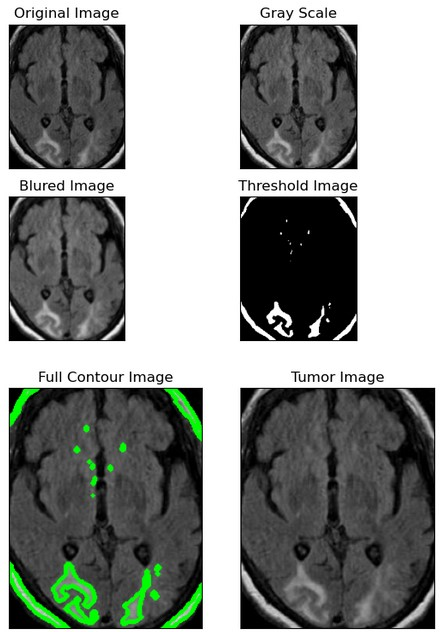
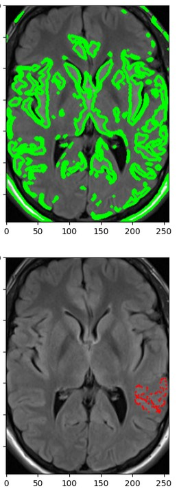
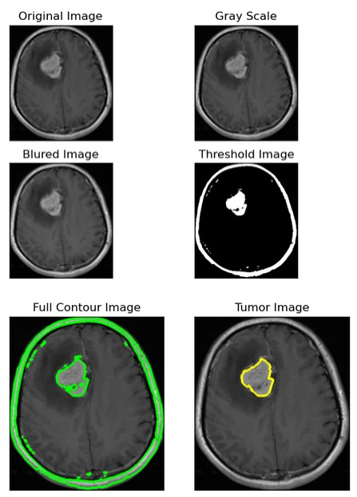
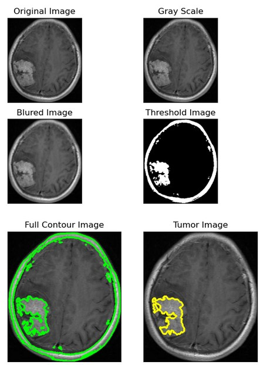
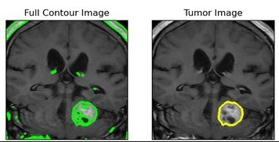
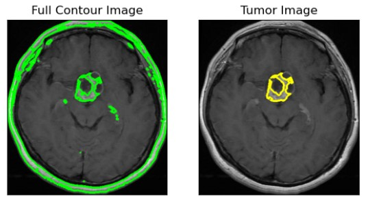
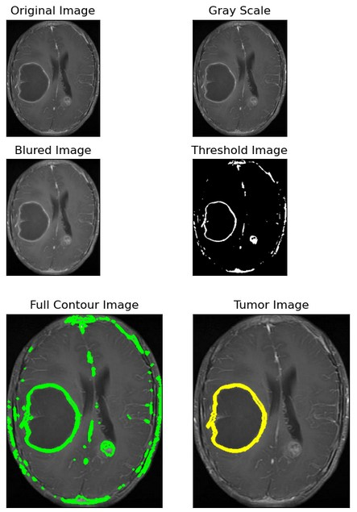
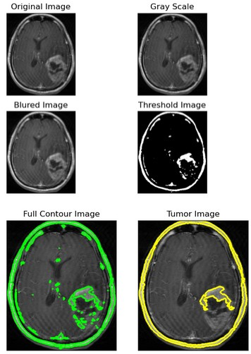

# Brain Tumor Detection using Machine Learning

## Table of contents:

- [Introduction](#introduction)
- [Project Steps](#project-steps)
- [Project Structure](#project-structure)
- [How to Run The Project](#run-the-project)
- [Team](#team)

### Introduction
This dataset contains 7023 human brain MRI images classified into 4 classes: glioma - meningioma - no tumor and pituitary.
no tumor class images were taken from the Br35H dataset, while SARTAJ dataset has a problem that glioma class images are not categorized correctly.

### project-steps
*First: Image Processing*
>
    1. Cropping to focus on brain shape
    2. Applying Gaussian Filter for blurring on gray scale images
    3. Apply Thresholding
    4. apply active contour for tumor shape extraction
>
*Second: Feature Extraction*
>
    1. Mean, Standard Deviation, Variance, Skewness, Entropy, RMS, Kurtios, HMI1, HMI2, HMI3, HMI4 of image
    2.  Area, Perimeter, Circular shape, Convex Area, Solidity, Equivalent Diameter, Major Axis, Minor Axis,  of The tumor after image contouring
    3.  GLCM features like contrast, homogeneity, energy, correlation, dissimilarity 
>

1. No Tumor Contours


2. Meningioma Tumor



4. Pituitary Tumor


6. Glioma Tumor



*Third: Modeling*
>
    1. Random Forest Classifier (90%)
    2. XGBoosting Classifier (91%)
    3. Support Vection Machine (88%)
    4. Knearest Knieghbour (87%)
>
>
*Fourth: Hyperparameter tuning and Feature selection*
>
    * Scaling data using Standard Scaler (increased the test accuracies of models)
    * Dimensionality Reduction Using PCA (was not a good option)
    * best feature was
>
*Fifth: Evaluation*
>
    * Confusion Matrix
    * F1 Score, Precision, and Recall
>

### project-structure
```
main
├─ Notebooks
│  ├─  Feature Extraction
│  ├─  Modelling and Evaluation
│  └─  Data Analysis
├─ Paper & contributions
├─ Contour Images & processed images
└─ README.md
```

### Run the Project
##### Install Python3 

```
Download it from www.python.org/downloads/
```

2. Install the following packages
```
pip install numpy
```
```
pip install Flask
```
```
pip install os
```
```
pip install PIL
```
```
pip install opencv-python
```
```
pip install skimage
```


### Team

First Semester - Biomedical Digital Signal Processing (SBE3110) class project created by:

| Team Members' Names                                  | Section | B.N. |
| ---------------------------------------------------- | :-----: | :--: |
| [Ahmed Hassan](https://github.com/ahmedhassan187)         |    1    |    |
| [Habiba Fathalla](https://github.com/Habibafathalla)       |    1    | 27   |
| [Rahma Abdelkader](https://github.com/rahmaabdelkader2) |    1    |  31  |
| [Yousr Ashraf](https://github.com/YousrHejy)       |    2    |  54  |

### Submitted to:

- Dr. Enas & Eng. Merna
  All rights reserved © 2023 to Team 2 - Systems & Biomedical Engineering, Cairo University (Class 2024)

    

